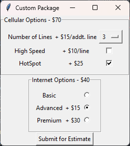

# NetStart Bundler User Manual

## Description

NetStart Bundler is a prototype application for a phone, internet, and cable service provider. It gives customers the option to choose a bundle or customize their own bundle and then displays an estimated monthly cost for the chosen plan.

## Main Window

The initial window displays multiple options for picking a service package. In the "Bundle Deals!" frame, there exist three preset offers for service, using a radio button for selection. Only one of these options may be selected at a time. Below are two buttons, "Proceed" and "Reset." Reset is disabled by default and will be addressed later. After selecting an option, select "Proceed" and a new window will appear.

Instead of using a predefined bundle, you may also customize your own package. Within the "Alternate Option" frame, select the "Customize" button to begin designing your own service package.

After selecting either the "Proceed" or "Customize" buttons, both of those buttons will be disabled until the "Reset" button is selected or the application is closed.

At the bottom of the window is an "Exit" button. Click this button at any time to close the application. Alternatively, you can click the "X" in the upper-right corner of the window.

## Bundle Window

If a bundle was selected and you pressed the "Proceed" button, a new window will appear. Below is an image of the Phone, Internet, and Cable package, also known as the Full Package. The other bundles will show only the options associated with the selected services. When the desired options are selected, click on the "Submit for Estimate" button to receive an estimate. Options are defined in more detail below.

#### Cellular Options

The base cost of a phone plan is $70. Extras can be added for an additional charge.
- The number of phone lines to be added to the plan is chosen using a dropdown menu. Each additional phone line past the first costs $15 extra.
- High speed connectivity can be added to the plan for $10 per line. Click the checkbox to add.
- HotSpot can be added to the plan for a flat rate of $25. Click the checkbox to add.

#### Internet Options

The basic internet package starts at $40. Additional options are available for an additional charge.
- For advanced connection speeds, add $15.
- For the best available package, the Premium package, add $30.

#### Cable Options

The basic cable package starts at $45. The package can be upgraded to the Advanced package for an additional $30 charge.

## Custom Plan

If you selected the "Customize" button, they will be brought to the following screen. By default, all of the boxes are unchecked. Check the boxes for the services you would like to receive. Select "Proceed" to continue and select the service options for your custom plan. Additional options are explained above under **Cellular Options**, **Internet Options**, and **Cable Options**. After selecting the service options, click the "Submit for Estimate" button to receive your estimate.

## Reset Button

If at any time you would like to start a new estimatation, navigate to the main window and select the "Reset" button. Doing so will close all other windows and re-enable the "Proceed" and "Customize" buttons, allowing you to select different service bundles and packages.

